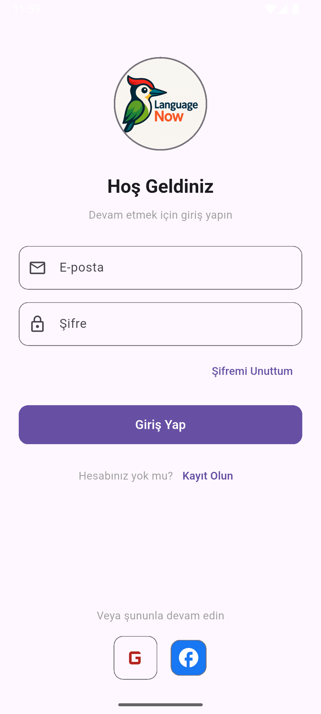
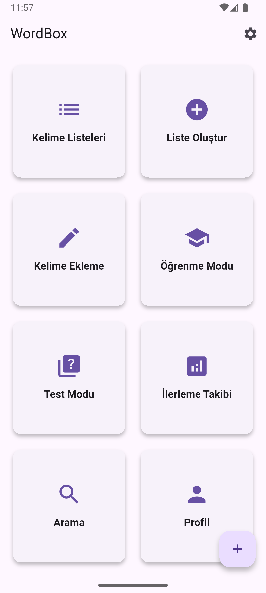
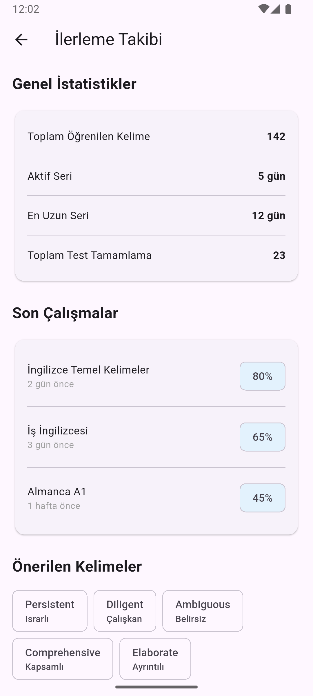

# 🌍 LanguageLearn - Akıllı Dil Öğrenme Uygulaması  

**Bilimsel yöntemlerle kalıcı dil öğrenme deneyimi**  

<div align="center">
  
  <p><em>Dinamik, kişiselleştirilmiş ve etkileşimli öğrenme</em></p>
</div>

## ✨ Öne Çıkan Özellikler  

✅ **Akıllı Kelime Öğrenme**  
- Spaced Repetition algoritması  
- Bağlamsal öğrenme teknikleri  

✅ **Gerçekçi Diyalog Simülasyonları**  
- Sesli yanıt analizi  
- Günlük yaşam senaryoları  

✅ **Oyunlaştırılmış Öğrenme**  
- Rozetler ve başarı sertifikaları  
- Liderlik tablosu  

✅ **Detaylı İlerleme Takibi**  
- Haftalık performans raporları  
- Zayıf nokta analizi  

## 🛠️ Teknoloji Stacki  

```mermaid
pie
    title Kullanılan Teknolojiler
    "Flutter" : 45
    "Firebase" : 30
    "Dart" : 20
    "Python (Backend)" : 5


<div align="center">    </div>
