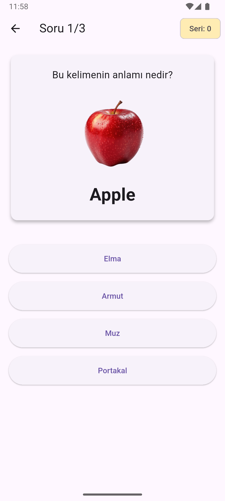
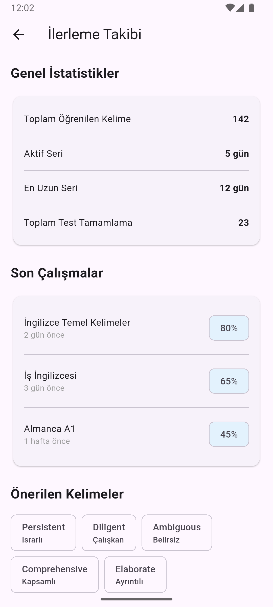

# 🌍 WordBox - Akıllı Dil Öğrenme Uygulaması  

**Bilimsel yöntemlerle kalıcı dil öğrenme deneyimi**  


## ✨ Öne Çıkan Özellikler  

✅ **Akıllı Kelime Öğrenme**  
- Spaced Repetition algoritması  
- Bağlamsal öğrenme teknikleri  

✅ **Gerçekçi Diyalog Simülasyonları**  
- Sesli yanıt analizi  
- Günlük yaşam senaryoları  

✅ **Oyunlaştırılmış Öğrenme**  
- Rozetler ve başarı sertifikaları  
- Liderlik tablosu  

✅ **Detaylı İlerleme Takibi**  
- Haftalık performans raporları  
- Zayıf nokta analizi  
Uygulama Görselleri:
<div align="center"> <div style="display: flex; flex-wrap: wrap; justify-content: center; gap: 10px;">     </div> </div>


## 🛠️ Teknoloji Stacki  

```mermaid
pie
    title Kullanılan Teknolojiler
    "Flutter" : 45
    "MongoDB" : 30
    "Dart" : 20
    "Node.js (Backend)" : 5


## 📹 Tanıtım Videosu
<div align="center">
  <a href="https://youtu.be/xVxE4h9wYcs" target="_blank">
    
  </a>
  <p><em>Uygulamamızı yakından tanımak için videomuzu izleyin!</em></p>
</div>
